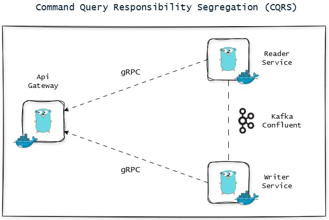

# 🚀 Advanced CQRS Implementation

This project demonstrates an advanced implementation of the Command Query Responsibility Segregation (CQRS) architectural pattern, leveraging a suite of modern technologies to build a resilient, scalable, and observable system.



## 🌟 Key Features & Technologies Used:

*   **Architectural Pattern**: 🏗️ CQRS (Command Query Responsibility Segregation)
*   **Programming Language**: 🐹 Go (Golang) for all services.
*   **API Gateway**: Serves as the single entry point for all client requests.
*   **Reader Service**: 📖
    *   **Databases**:
        *   **MongoDB**: Utilized as the primary data store for queries, offering schema flexibility.
        *   **Redis**: Employed as a caching layer to accelerate responses for frequently accessed queries.
*   **Writer Service**: ✍️
    *   **Database**: **PostgreSQL**: Used as the primary data store for commands, ensuring data consistency and transactional integrity.
*   **Inter-Service Communication (Data Synchronization)**: 📬
    *   **Kafka (Confluent Platform)**: Acts as an event bus to asynchronously propagate data changes (events) from the Writer Service to the Reader Service, ensuring eventual consistency.
*   **API Gateway to Services Communication**: 📡
    *   **Unary gRPC**: Leveraged for efficient and typed communication between the API Gateway and both the Reader and Writer Services.
*   **Monitoring & Observability**: 📊
    *   **OpenTelemetry (OTLP)**: Implemented in each service (API Gateway, Reader Service, Writer Service) to collect telemetry data (traces, metrics, logs) and export it via OTLP (OpenTelemetry Protocol) to an observability backend (e.g., Jaeger, Prometheus, Grafana Loki).
*   **Containerization & Orchestration**: 🐳
    *   **Docker & Docker Compose**: All services and dependencies (databases, Kafka) are containerized and managed using Docker Compose for ease of setup and deployment in a development environment.

## ⚙️ How the System Works:

1.  **Command Flow**:
    *   A client sends a command (e.g., create a new user, update a product) to the **API Gateway**.
    *   The API Gateway forwards this command via **gRPC** to the **Writer Service**.
    *   The Writer Service validates the command, performs business operations, and saves/updates data in **PostgreSQL**.
    *   Upon success, the Writer Service publishes an *event* (e.g., `UserCreatedEvent`, `ProductUpdatedEvent`) to a topic in **Kafka**.

2.  **Query Flow**:
    *   A client sends a query (e.g., get user details, search for a list of products) to the **API Gateway**.
    *   The API Gateway forwards this query via **gRPC** to the **Reader Service**.
    *   The Reader Service first attempts to retrieve data from the **Redis** cache.
    *   If the data is not found in Redis (cache miss), the Reader Service fetches the data from **MongoDB** (which is the read model optimized for queries).
    *   The data is then returned to the client via the API Gateway.

3.  **Data Synchronization (Eventual Consistency)**:
    *   The **Reader Service** acts as a consumer, subscribing to relevant Kafka topics.
    *   When an *event* is published by the Writer Service to Kafka, the Reader Service consumes this event.
    *   Based on the received event, the Reader Service updates its data in **MongoDB** and, if necessary, invalidates/updates the cache in **Redis**. This ensures the read model remains eventually consistent with the write model.

4.  **Monitoring**:
    *   Each service (API Gateway, Reader, Writer) is instrumented with the **OpenTelemetry SDK**.
    *   Telemetry data (traces, metrics) is sent using an **OTLP exporter** to an OpenTelemetry collector or directly to an observability backend (e.g., Jaeger for tracing, Prometheus for metrics).
    *   This enables performance monitoring, end-to-end request tracing, and issue diagnosis across the distributed system.

## 🛠️ Running the Project:

This project is designed to be easily run using Docker Compose.

1.  **Prerequisites**:
    *   Docker installed
    *   Docker Compose installed

2.  **Steps**:
    *   Clone the project repository (if applicable).
    *   Navigate to the project's root directory.
    *   Run the following command in your terminal:
        ```bash
        docker-compose up -d
        ```
    *   This will build the images for each service (if not already built) and run all containers (API Gateway, Reader Service, Writer Service, PostgreSQL, MongoDB, Redis, Kafka, Zookeeper, and OpenTelemetry components like a Collector/Jaeger).

3.  **Access & Verification**:
    *   Access the API Gateway via its specified endpoint (e.g., `http://localhost:8080`).
    *   Check the logs from individual containers using `docker-compose logs <service_name>`.
    *   Access the observability backend UI (e.g., Jaeger UI at `http://localhost:16686`) to view traces.

## 💡 Potential Future Enhancements:

*   Implementation of the Saga Pattern for distributed transactions.
*   Integration with an authentication and authorization system (e.g., OAuth2, JWT).
*   Addition of more comprehensive metrics and Grafana dashboards.
*   More extensive unit, integration, and end-to-end testing.
*   Deployment to cloud platforms (e.g., Kubernetes, AWS ECS, Google Cloud Run).

---

This project showcases a strong understanding of microservices architecture, the CQRS pattern, asynchronous communication, and the importance of observability in modern systems.